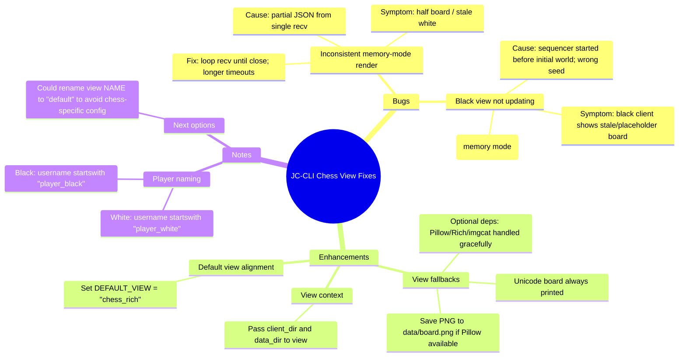

```mermaid
mindmap
  root((JC-CLI Chess View Fixes))
    Bugs
      Inconsistent memory-mode render
        Symptom: half board / stale white
        Cause: partial JSON from single recv
        Fix: loop recv until close; longer timeouts
      Black view not updating
        Symptom: black client shows stale/placeholder board
        Cause: sequencer started before initial world; wrong seed
        Fix: restart sequencer after initial_world (memory mode)
    Enhancements
      View fallbacks
        Unicode board always printed
        Save PNG to data/board.png if Pillow available
        Optional deps: Pillow/Rich/imgcat handled gracefully
      View context
        Pass client_dir and data_dir to view
      Default view alignment
        Set DEFAULT_VIEW = "chess_rich"
    Notes
      Player naming
        White: username startswith "player_white"
        Black: username startswith "player_black"
      Next options
        Could rename view NAME to "default" to avoid chess-specific config
```

